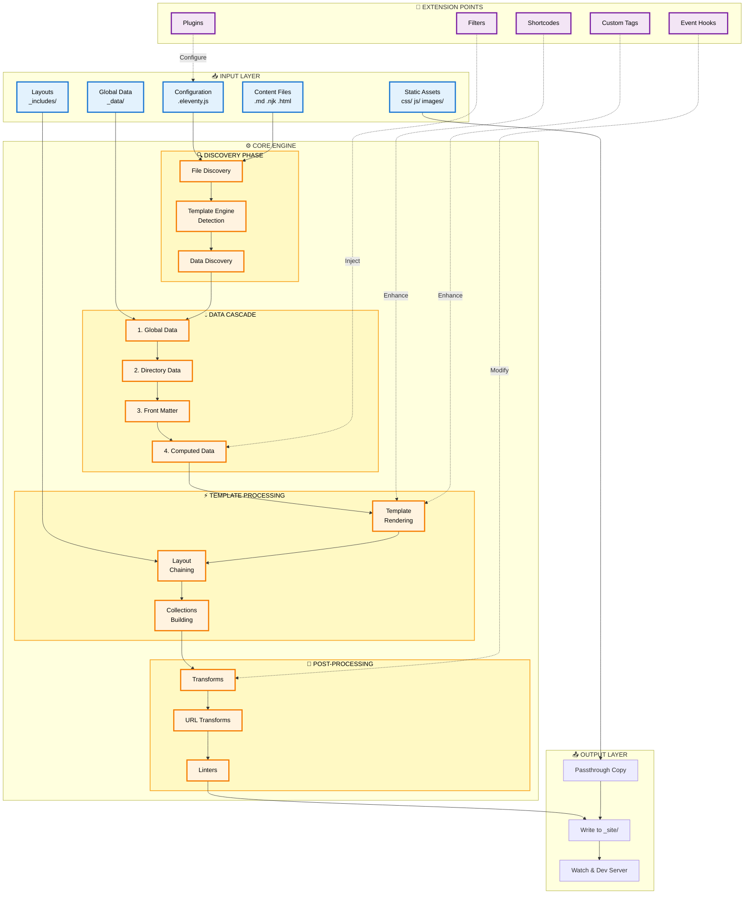

```mermaid
graph TB
    subgraph Input["📥 INPUT LAYER"]
        CF["Configuration<br/>.eleventy.js"]
        CT["Content Files<br/>.md .njk .html"]
        GD["Global Data<br/>_data/"]
        IN["Layouts<br/>_includes/"]
        AS["Static Assets<br/>css/ js/ images/"]
    end

    subgraph Core["⚙️ CORE ENGINE"]
        direction TB
        
        subgraph Discovery["🔍 DISCOVERY PHASE"]
            FD["File Discovery"]
            TE["Template Engine<br/>Detection"]
            DD["Data Discovery"]
        end
        
        subgraph DataCascade["💧 DATA CASCADE"]
            DC1["1. Global Data"]
            DC2["2. Directory Data"]
            DC3["3. Front Matter"]
            DC4["4. Computed Data"]
        end
        
        subgraph Processing["⚡ TEMPLATE PROCESSING"]
            TR["Template<br/>Rendering"]
            LC["Layout<br/>Chaining"]
            CO["Collections<br/>Building"]
        end
        
        subgraph Transform["🔄 POST-PROCESSING"]
            TF["Transforms"]
            UT["URL Transforms"]
            LN["Linters"]
        end
    end

    subgraph Extensions["🔌 EXTENSION POINTS"]
        PL["Plugins"]
        FI["Filters"]
        SC["Shortcodes"]
        CT_EXT["Custom Tags"]
        EV["Event Hooks"]
    end

    subgraph Output["📤 OUTPUT LAYER"]
        PC["Passthrough Copy"]
        WR["Write to _site/"]
        WS["Watch & Dev Server"]
    end

    CF --> FD
    CT --> FD
    GD --> DC1
    IN --> LC
    AS --> PC

    FD --> TE
    TE --> DD
    DD --> DC1
    
    DC1 --> DC2
    DC2 --> DC3
    DC3 --> DC4
    
    DC4 --> TR
    TR --> LC
    LC --> CO
    
    CO --> TF
    TF --> UT
    UT --> LN
    
    LN --> WR
    PC --> WR
    WR --> WS

    PL -.->|Configure| CF
    FI -.->|Inject| DC4
    SC -.->|Enhance| TR
    CT_EXT -.->|Enhance| TR
    EV -.->|Modify| TF

    classDef inputStyle fill:#e3f2fd,stroke:#1976d2,stroke-width:3px,color:#000
    classDef coreStyle fill:#fff3e0,stroke:#f57c00,stroke-width:3px,color:#000
    classDef extensionStyle fill:#f3e5f5,stroke:#7b1fa2,stroke-width:3px,color:#000
    classDef outputStyle fill:#e8f5e9,stroke:#388e3c,stroke-width:3px,color:#000
    classDef phaseStyle fill:#fff9c4,stroke:#f9a825,stroke-width:2px,color:#000

    class CF,CT,GD,IN,AS inputStyle
    class FD,TE,DD,DC1,DC2,DC3,DC4,TR,LC,CO,TF,UT,LN coreStyle
    class Discovery,DataCascade,Processing,Transform phaseStyle
    class PL,FI,SC,CT_EXT,EV extensionStyle
    class PC,WR,WS **outputStyle**
```