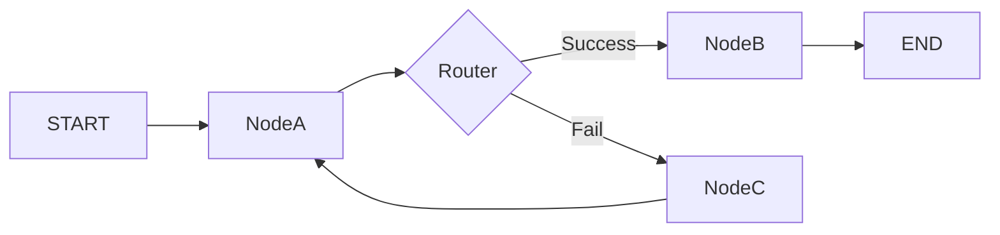

# Nodes & Edges

**Core definition:** The two fundamental building blocks of a LangGraph. **Nodes** perform work (compute), and **Edges** determine the path (control flow).

**Position in ecosystem:**
These are the primitives. You build the entire agent topology using just these two concepts.

**Key idea:**
- **Node:** Doing things (Tools, LLM calls, Print statements).
- **Edge:** Going places (Start -> A -> B -> End).

## Essential Characteristics

### Nodes (The "Doers")
- Python functions that take the current `State` as input.
- Return a dictionary of updates to apply to the State.
- **Special Nodes:**
    - `START`: entry point.
    - `END`: exit point (termination).

### Edges (The "Directors")
- **Normal Edge:** Fixed transition. `A -> B`. Always go to B after A.
- **Conditional Edge:** Dynamic transition. `A -> (Router) -> B or C`.
    - Uses a routing function to decide the next node based on state content.

## Visual Representation



## Code Gist

```python
# Adding Nodes
workflow.add_node("agent", call_model)
workflow.add_node("tools", tool_executor)

# Adding Edges
workflow.add_edge(START, "agent")
workflow.add_conditional_edges(
    "agent",
    should_continue,  # Routing function
    {
        "continue": "tools",
        "end": END
    }
)
```

## Quick Summaries

**30-second version:** Nodes are the workers doing specific tasks like "Search Google" or "Draft Email". Edges are the managers pointing the finger at who works next. Conditional edges are smart managers who check the result of the last job before deciding who's up next.

**One-line recall:**
**Nodes do the work; Edges decide the path.**

---

## Linked Concepts
- [[Control Flow & Routing]]
- [[Graphs vs Chains]]
- [[Functions in LangGraph]]

---
**Last updated:** December 2025
