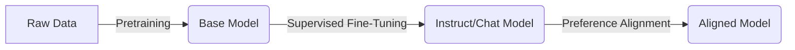

# How LLMs Are Trained

**Core Definition:** LLM training is a multi-stage process that transforms a random initialization into a knowledgeable base model, and then refines it into a helpful assistant. The standard pipeline consists of **Pretraining**, **Supervised Fine-Tuning (SFT)**, and **Preference Alignment (RLHF/DPO)**.

## The Training Lifecycle

The process is generally divided into three sequential phases:

## Phase 1: Pretraining (Self-Supervised Learning)

This is the most computationally expensive phase (99% of compute).

*   **Goal:** Teach the model "knowledge" and language patterns.
*   **Data:** Massive datasets (trillions of tokens) from the web, books, code, papers (e.g., Common Crawl, Github).
*   **Method:** **Self-Supervised Learning**. The model hides part of the text and tries to predict it (Next-Token Prediction). No human labelers are needed, just raw text.
*   **Result (Base Model):** A model that can complete text but cannot follow instructions. If you ask "What is the capital of Paris?", it might reply "and what is the capital of Berlin?" (continuing the pattern) rather than answering "Paris".

## Phase 2: Supervised Fine-Tuning (SFT)

This turns a "document completer" into an "assistant".

*   **Goal:** Teach the model to follow instructions and adopt a specific format.
*   **Data:** High-quality, human-curated `<prompt, response>` pairs (e.g., thousands to millions of examples).
*   **Method:** The model is trained to predict the *response* given the *prompt*, usually keeping the pre-trained weights but adjusting them to prioritize helpful answers.
*   **Result (SFT Model):** A model that answers questions and follows rules. However, it might still hallucinate or produce unsafe content if not checked.

## Phase 3: Preference Alignment (RLHF / DPO)

This aligns the model with human values (Helpfulness, Honesty, Safety).

*   **Goal:** Refine the style, safety, and tone; discourage bad behaviors.
*   **Methods:**
    *   **RLHF (Reinforcement Learning from Human Feedback):** Humans rank multiple model outputs. A "Reward Model" learns these preferences and trains the LLM to maximize the reward.
    *   **DPO (Direct Preference Optimization):** A simpler, more stable method that optimizes the model directly on preference pairs without a separate reward model.
*   **Result (Chat/Aligned Model):** The final version users interact with (e.g., ChatGPT, Claude, Llama-Chat). It refuses harmful requests and favors high-quality responses.

## Base vs. Instruct/Chat Models

Understanding the difference is critical for prompt engineering.

| Feature | Base Model (Pre-trained) | Chat/Instruct Model (Fine-tuned) |
| :--- | :--- | :--- |
| **Example** | Llama-3-70B, GPT-4-Base | Llama-3-70B-Instruct, GPT-4o |
| **Input Format** | Raw text stream | Structured messages (System, User) |
| **Best Used For** | Text completion, few-shot classification | Chatbots, detailed instruction following |
| **Behavior** | "Dreamy", purely completion-based | "Helpful", objective-oriented |
| **Prompting** | Needs careful few-shot examples to work | Works with direct natural language |

## Quick Summaries

**30-second version:**  
LLMs start as **Base Models** trained on internet-scale text to learn language (Pretraining). They are then taught to follow instructions using specific Q&A examples (**SFT**). Finally, they are polished to be safe and preferred by humans using feedback techniques like **RLHF** or **DPO**.

**One-line recall:**  
**Pretraining teaches knowledge (completion), SFT teaches behavior (instruction following), and Alignment teaches style & safety (preference).**

---

**Section:** **1.1.1.2 How LLMs Are Trained**  
**Focus:** Training lifecycle  
**Last updated:** December 2025

---
