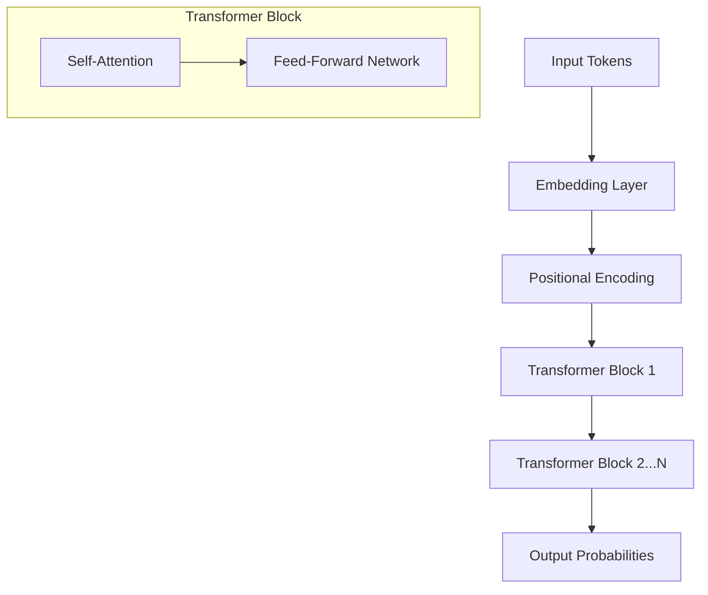

# Transformer Architecture Overview

**Core Definition:** The **Transformer** is the deep learning architecture that powers all modern LLMs. Introduced by Google in 2017 ("Attention Is All You Need"), it replaced Recurrent Neural Networks (RNNs) by allowing models to process entire sequences of data in parallel using a mechanism called **Self-Attention**.

## Why It Changed Everything

Before Transformers, models (RNNs/LSTMs) processed text sequentially (word by word). This had two major flaws:
1.  **Slow training:** You couldn't parallelize relationships across a sentence.
2.  **Forgetting:** The model struggled to remember context from the beginning of a long paragraph.

Transformers solved this with **Parallelization** (processing all tokens at once) and **Attention** (directly connecting every token to every other token).

## Key Components

### 1. Self-Attention Mechanism
The "brain" of the model. It allows each token to look at other tokens in the sequence to gather context before making a prediction.
*   *Analogy:* When reading the word "bank" in "river bank", self-attention looks at "river" to understand it means the side of a river, not a financial institution.

### 2. Positional Encodings
Since the model processes all words simultaneously, it doesn't inherently know which came first. Positional encodings are mathematical vectors added to tokens to store information about their order (1st, 2nd, 3rd position).

### 3. Decoder-Only Architecture (GPT Style)
Most modern GenAI models (GPT-4, Llama, Claude) use a **Decoder-only** architecture.
*   **Encoder-only (BERT):** Good for understanding/classification (looks at whole sentence).
*   **Decoder-only (GPT):** Good for generation (predicts next token based strictly on previous ones).

## Visualizing the Flow

## Attention Head & Context

*   **Attention Heads:** The model uses multiple "heads" (e.g., 32 or 128) to focus on different types of relationships simultaneously (e.g., one head tracks grammar, another tracks pronoun references).
*   **Context Window:** The "Attention Span" of the model. The architecture limits how many tokens it can "attend" to at once (e.g., 8k, 128k).

## Quick Summaries

**30-second version:**  
The Transformer architecture revolutionized AI by enabling parallel processing and long-range context handling via **Self-Attention**. Unlike older models, it looks at the entire meaningful context at once to predict the next token. Modern LLMs mostly use the **Decoder-only** variant of this architecture.

**One-line recall:**  
**Transformers use Self-Attention to process entire sequences in parallel, enabling the scale and context understanding of modern LLMs.**

---

**Section:** **1.1.1.3 Transformer Architecture Overview**  
**Focus:** Model internals  
**Last updated:** December 2025

---
