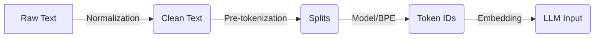

# Tokenization Process

**Core Definition:** The **Tokenization Process** is the pipeline that converts raw human text into a sequence of numbers (IDs) that the model can process, and back again. It is a deterministic step that happens *outside* the neural network itself.

## The Pipeline

The journey from prompt to model input involves specific stages:

### 1. Normalization
Basic cleanup to ensure consistency.
*   Unicode normalization (NFC/NFD).
*   Lowercasing (usually NOT done for modern Case-Sensitive models, but common in older ones).

### 2. Pre-tokenization
Splitting text into coarse chunks before applying the complex algorithm.
*   Usually splits by whitespace and punctuation.
*   Input: `"Hello, world!"` -> `["Hello", ",", "world", "!"]`

### 3. Subword Tokenization (The Core)
The algorithm (e.g., **BPE**, **WordPiece**) breaks the pre-tokenized words into the final vocabulary units.
*   It looks up the subwords in its fixed vocabulary (e.g., GPT-4 has ~100k tokens in its vocabulary).
*   `["Hello"]` -> `[15496]`
*   `["world"]` -> `[995]`

### 4. Encoding vs. Decoding
*   **Encoding:** Text `"Hello"` -> IDs `[15496]` (Input to LLM)
*   **Decoding:** IDs `[15496]` -> Text `"Hello"` (Output to User)

## Common Algorithms

| Algorithm | Used By | approach |
| :--- | :--- | :--- |
| **BPE (Byte-Pair Encoding)** | GPT-2, GPT-3, GPT-4, Llama | Merges most frequent byte pairs iteratively. |
| **WordPiece** | BERT | Similar to BPE but maximizes likelihood of training data. |
| **SentencePiece** | T5, older Llama | Treats input as a raw stream (language agnostic). |
| **Tiktoken** | OpenAI Models | A fast implementation of BPE. |

## Why It Matters for Engineering
1.  **Cost:** You pay per token (input + output). Understanding the process helps estimation.
2.  **Context Window:** The 128k limit refers to *token IDs*, not characters.
3.  **Glitches:** "SolidGoldMagikarp" was a famous glitch token that broke GPT-3 because of how it was tokenized from reddit data.

## Quick Summaries

**30-second version:**  
Tokenization is a deterministic translation layer. It cleans text, splits it, and maps chunks to integer IDs from a fixed vocabulary (like BPE). The model only ever sees these numbers. The reverse process (Decoding) turns the model's output numbers back into text.

**One-line recall:**  
**Raw Text → Normalization → Tokenizer (BPE) → Integer IDs → Neural Network.**

---

**Section:** **1.1.1.5 Tokenization Process**  
**Focus:** Text preprocessing  
**Last updated:** December 2025

---
