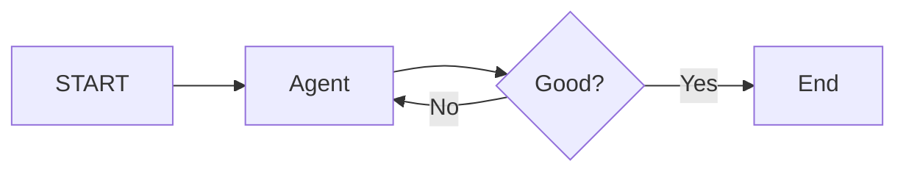

# Loops & Iteration

**Core definition:** **Loops** allow an agent to repeat steps (cycles) until a specific condition is met, enabling "think-act-observe" patterns.

**Position in ecosystem:**
This is the "Graph" part of LangGraph. Most other frameworks struggle with cyclic dependencies; LangGraph treats them as a first-class feature.

**Key idea:**
- **Cycle:** `A -> B -> A`.
- **Termination:** You *must* have a condition to break the loop (e.g., "Answer found" or "Max steps reached").

## Essential Characteristics

**1. Reasoning Loops:** The agent tries to solve a problem, gets an error or partial result, and tries again.
**2. Self-Correction:** The agent can critique its own output and loop back to fix it.
**3. Max Recursion Limit:** LangGraph has a built-in safety (default 25 steps) to prevent infinite loops from draining your wallet.

## How It Works



## Logic Example

```python
# Infinite loop until "exit"
def should_continue(state):
    if state["response"] == "exit":
        return "end"
    return "agent" # Look back to agent node
```

## Quick Summaries

**30-second version:** Loops let an agent try again. Just like you don't submit the first draft of an email but read and edit it first, LangGraph allows agents to loop through a "Draft -> Review -> Edit" cycle until the result is perfect.

**One-line recall:**
**Loops enable iterative reasoning and self-correction.**

---

## Linked Concepts
- [[Control Flow & Routing]]
- [[Error Handling & Recovery]]
- [[Performance & Cost]]

---
**Last updated:** December 2025
