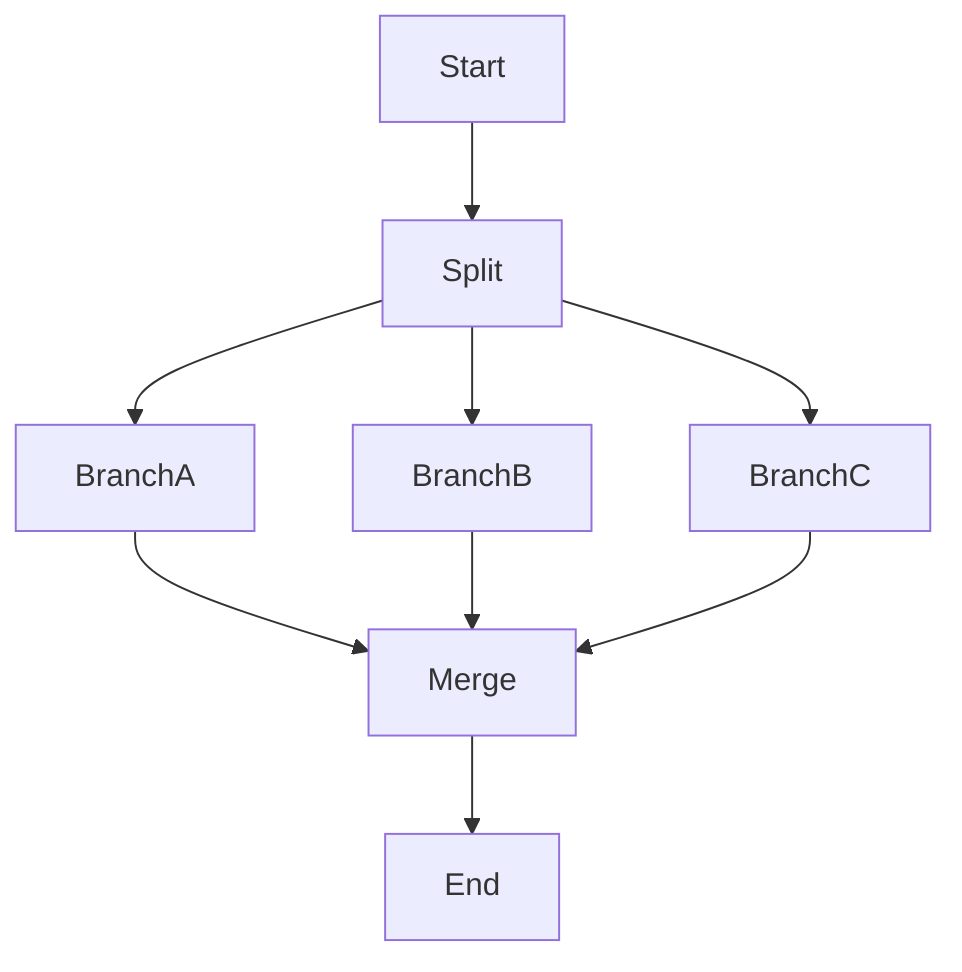

# Parallelism & Concurrency

**Core definition:** **Parallelism** in LangGraph allows multiple nodes to execute **simultaneously** (fan-out) and then combine their results (fan-in).

**Position in ecosystem:**
Speeds up agents significantly. Instead of Research -> Write -> Review, do (Research Topic A + Research Topic B) -> Write.

**Key idea:**
- **Fan-Out:** One node points to multiple next nodes.
- **Fan-In:** Multiple nodes point to one next node.
- **Asyncio:** Leverages Python's async capabilities for I/O bound tasks (like calling 3 LLMs at once).

## Essential Characteristics

**1. Speed:** Reduces total latency by running independent tasks at the same time.
**2. Ensembling:** Ask 3 different models the same question and vote on the best answer.
**3. Map-Reduce:** Split a big document into chunks, summarize each chunk parallelly, and merge.

## Visual Representation



## How It Works in Code
You simply add edges from one node to multiple others.

```python
# Fan-out
workflow.add_edge("start", "research_a")
workflow.add_edge("start", "research_b")

# Fan-in (LangGraph waits for both to finish before running 'writer')
workflow.add_edge("research_a", "writer")
workflow.add_edge("research_b", "writer")
```

## Quick Summaries

**30-second version:** Instead of one person doing three chores one by one, you hire three people to do them all at the same time. Then one manager collects all the completed work. It costs more resources (compute) but saves a lot of time.

**One-line recall:**
**Parallelism executes independent graph branches simultaneously.**

---

## Linked Concepts
- [[Nodes & Edges]]
- [[Performance & Cost]]
- [[State Management]]

---
**Last updated:** December 2025
