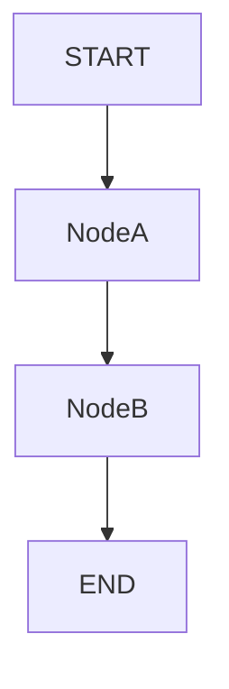

# Visualization & Representation

**Core Definition:** Methods to "see" your graph structure. Since graphs are non-linear, reading the code (`graph.py`) is often harder than looking at a picture.

## 1. Mermaid Diagrams
LangGraph has built-in support for generating Mermaid.js syntax.

```python
print(graph.get_graph().draw_mermaid())
```

**Output:**


This is extremely useful for documentation (`README.md`).

## 2. ASCII Art
For quick terminal debugging:
```python
print(graph.get_graph().draw_ascii())
```

## 3. LangGraph Studio
The gold standard.
-   **Interactive:** You can drag nodes, see the state at each step.
-   **Live:** It connects to your running code.

## 4. Why Visualize?
1.  **Orphan Check:** Did you forget to connect the `fail_path` to `END`? It shows up as a dangling node.
2.  **Loop Confirmation:** Is the arrow pointing back to specific node, or to the start of the whole graph?
3.  **Stakeholder Communication:** Show the PM the flow chart, not the Python code.

## Quick Summary

**1-Line Recall:** **Always visualize your graph (Mermaid/Studio) to confirm the topology matches your mental model; bugs hide in the edges.**
